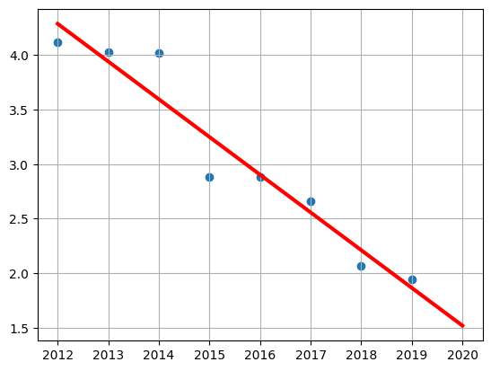
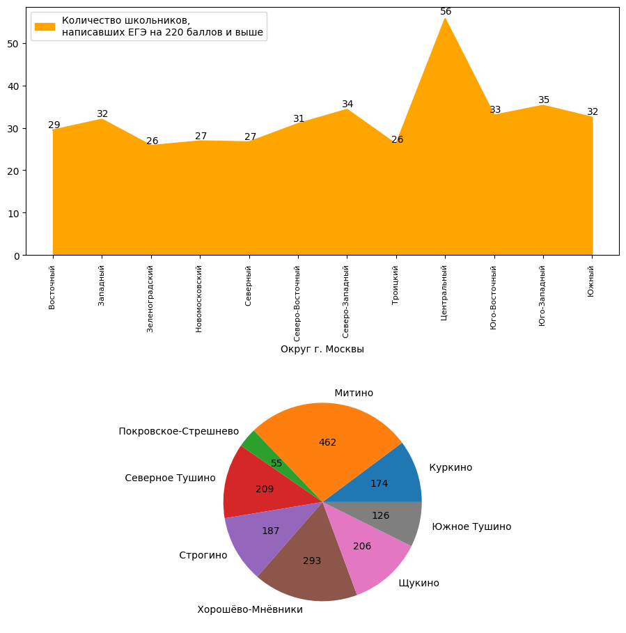
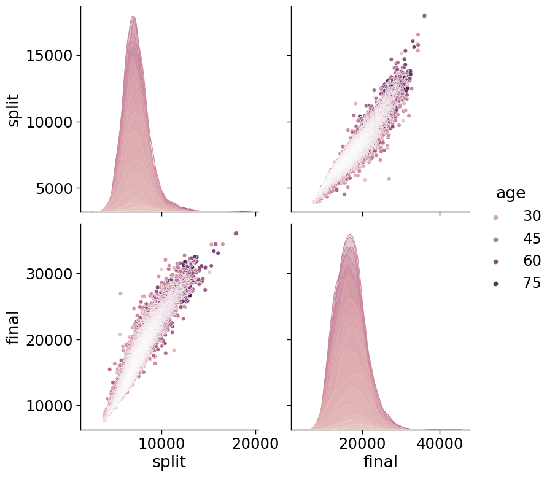
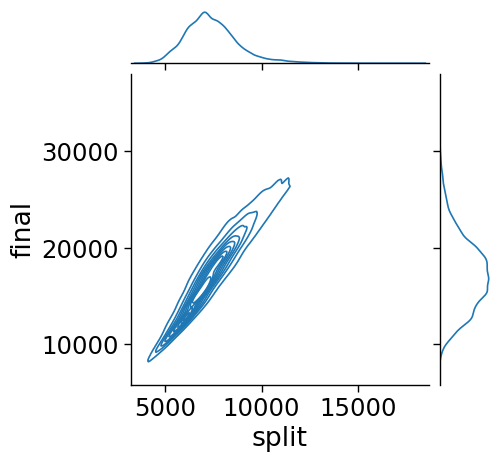
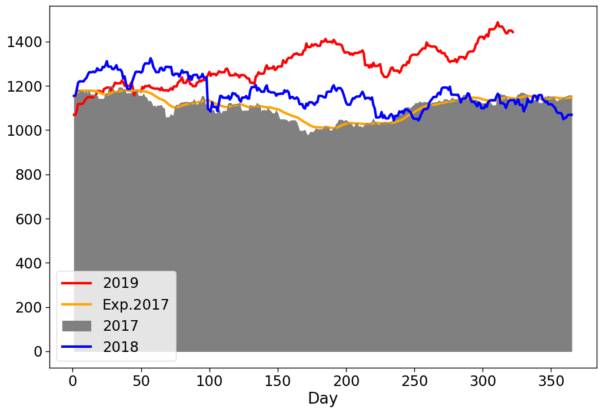

# Data Analysis Portfolio
## The result of training on the ittensive.com platform. Advanced Python Course
### student Lyubimova D.A.
___
**Part 1: Data Analysis**

The first part of the course was devoted to studying and solving problems on the following topics:

+ *1.1 numpy and pandas*

     Working with data via pandas and importing data from text files
  ```python
  import pandas as pd
data_1=pd.read_csv('https://video.ittensive.com/python-advanced/data-5283-2019-10-04.utf.csv', delimiter=';')
  ```

+ *1.2 Indexes and frame merging*

     Combining data from multiple sources

+ *1.3 Filtering and modifying data*

     Applying filtering and transforming data in frames
+ *1.4 Linear Regression*
     Making predictions on data with pandas
     
     


**Part 2: Data import and parsing**

- *2.1 Data import*

     Working with API, JSON and XML format. GET/POST requests and SOAP.
- *2.2 Data parsing*
  
   Working with HTML documents and BeatifulSoup
  
- *2.3 Web Scraping*

     Extracting data from the entire site

- *2.4 Working with SQL*

     SQLite and working with SQL from Python

**Part 3: Data Visualization**

- *3.1 Matplotlib Basics*
   Selecting and building a visualization for data
   
  
- *3.2 Visualization of dependencies*

     Working with seaborn and building relationships between data
  
  
- *3.3 Time series*

     Working with chronological data series and building candlestick charts
    
- *3.4 Geo-data and cartograms*

     Working with geo-data and creating background cartograms
    

**Part 4: Reporting and Automation**
- *4.1 Working with PDF*

     Working with creating and converting PDF documents

- *4.2 Basic reports*

     Create reports in HTML and convert them to PDF

- *4.3 Report Generation*

     Working with a template engine and automated reporting

- *4.4 Email sending and integration*

     Working with sending mail and running a scheduled task
