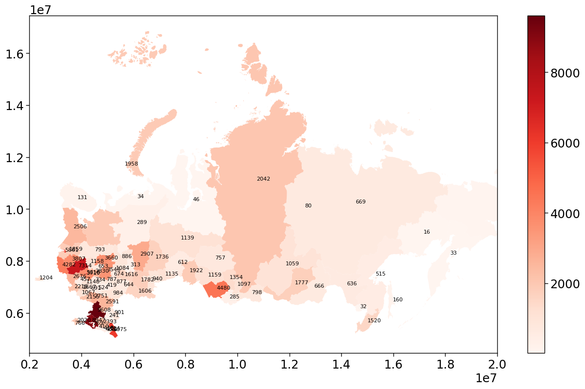

# Data Analysis Portfolio
## The result of training on the ittensive.com platform. Advanced Python Course
### student Lyubimova D.A.
___
**Part 1: Data Analysis**

The first part of the course was devoted to studying and solving problems on the following topics:

+ *1.1 numpy and pandas*

     Working with data via pandas and importing data from text files
     

``` python
import pandas as pd 
data_1=pd.read_csv('https://video.ittensive.com/python-advanced/data-5283-2019-10-04.utf.csv', delimiter=';') 
```
+ *1.2 Indexes and frame merging*

     Combining data from multiple sources

+ *1.3 Filtering and modifying data*

     Applying filtering and transforming data in frames

``` python
data=pd.read_csv('https://video.ittensive.com/python-advanced/data-9753-2019-07-25.utf.csv', delimiter=';')
data=data[['Year', 'UnemployedDisabled','UnemployedTotal']]
data=data.set_index('Year')
data['Procent']=round(data['UnemployedDisabled']*100/data['UnemployedTotal'], 1)
print(data.index [data['Procent']<2 ].tolist ()[0])
```

+ *1.4 Linear Regression*
     Making predictions on data with pandas
     
     


**Part 2: Data import and parsing**

- *2.1 Data import*

     Working with API, JSON and XML format. GET/POST requests and SOAP.

```python
import requests
import json
request_headers={
    'Content-Type' : 'application/json',
    'Accept' : 'application/json; caharset=UTF-8'
}
url='https://geocode-maps.yandex.ru/1.x/?format=json&apikey=514dc5bd-ce7e-4dbe-a7cc-0eea96f46fc3&geocode=Самара'
response=requests.get(url,headers=request_headers)
print(response.status_code)
response=json.loads(response.content)
print(response['response']['GeoObjectCollection']['featureMember'][0]['GeoObject']['Point']['pos'].split(" ")[0])
```
- *2.2 Data parsing*
  
   Working with HTML documents and BeatifulSoup

``` python
with open('/birzha.html', 'r') as f:
contents = f.read()
soup = BeautifulSoup(contents, 'lxml')
table=soup.find('table', {'id':'marketDataList'})
```
  
- *2.3 Web Scraping*

     Extracting data from the entire site
```python
r=requests.get('https://video.ittensive.com/data/018-python-advanced/beru.ru/', headers=headers)
html=BeautifulSoup(r.content)
print(html)
links=html.find_all("a", {"class": "grid-snippet__react-link"})
```

- *2.4 Working with SQL*

     SQLite and working with SQL from Python

```python
import sqlite3
import numpy as np
import pandas as pd
conn=sqlite3.connect('E:\Dari\ITtensive\БД\sqllite') #соединение
db=conn.cursor() #создание объекта для работы с бд
#запрос:
'''db.execute("""CREATE TABLE films
            (id INTEGER PRIMARY KEY AUTOINCREMENT NOT NULL,
            url text,
            title text default '',
            budget INTEGER default 0,
            sales_www INTEGER default 0)""")
conn.commit() #чтобы выполнить запрос'''
'''db.execute("""CREATE TABLE sample
            (id INTEGER PRIMARY KEY AUTOINCREMENT NOT NULL,
            name text)""")'''
conn.commit() #чтобы выполнить запрос
names=np.loadtxt('names.txt', dtype='str')
for name in names:
    db.execute('INSERT INTO sample (name) VALUES (?)', (name,))
conn.commit()
data=np.array(db.execute('SELECT * FROM sample').fetchall())
print(data)
data=pd.read_sql_query('SELECT * FROM sample', conn)
print(data)
```

**Part 3: Data Visualization**

- *3.1 Matplotlib Basics*
   Selecting and building a visualization for data
   
  
- *3.2 Visualization of dependencies*

     Working with seaborn and building relationships between data
  
  
- *3.3 Time series*

     Working with chronological data series and building candlestick charts
    
- *3.4 Geo-data and cartograms*

     Working with geo-data and creating background cartograms
    

**Part 4: Reporting and Automation**
- *4.1 Working with PDF*

     Working with creating and converting PDF documents

```python
from reportlab.pdfgen import canvas
from reportlab.lib import pagesizes
from reportlab.pdfbase import pdfmetrics
from reportlab.pdfbase.ttfonts import TTFont
PDF = canvas.Canvas("title.pdf", pagesize = pagesizes.A4)
```

- *4.2 Basic reports*

     Create reports in HTML and convert them to 
```python
import pandas as pd
import pdfkit
data = pd.read_csv("https://video.ittensive.com/python-advanced/data-102743-2019-11-13.utf.csv", delimiter=";")
html = '''<html>
<head>
<title>Геральдические символы Москвы</title>
<meta charset=\"utf-8\"/>
</head>
<body>'''
for i, item in data.iterrows():
    if i == 0:
        html += '<h1>' + item['Name'] + '</h1>'
    else:
        html += '<h1 style=\"page-break-before:always\">' + item['Name'] + '</h1>'
    html += '''<p>
        
    </p>'''
    html += '<p style=\"font-size:150%\">' + item['Description'] + '</p>'
html += '</body></html>'
config = pdfkit.configuration(wkhtmltopdf='C:/Program Files/wkhtmltopdf/bin/wkhtmltopdf.exe')
options = {'page-size': 'A4','header-right': '[page]'}
pdfkit.from_string(html, 'heraldic.pdf', configuration=config, options=options
```

- *4.3 Report Generation*

     Working with a template engine and automated reporting
``` python
config = pdfkit.configuration(wkhtmltopdf='C:/Program Files/wkhtmltopdf/bin/wkhtmltopdf.exe')
options = {
    'page-size': 'A4',
    'header-right': '[page]'
}
pdfkit.from_string(html, 'parks.pdf',
                   configuration=config, options=options)
with open("parks.html", "w", encoding="utf-8") as file:
    file.write(html)
```

- *4.4 Email sending and integration*

     Working with sending mail and running a scheduled task
```python
server = smtplib.SMTP_SSL("smtp.yandex.com", 465)
server.login(user, password)
server.sendmail("divinadar@yandex.ru",
               "support@ittensive.com",
               letter.as_string())
server.quit()
```
